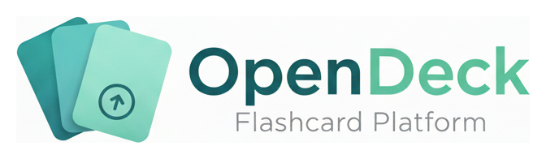

# OpenDeck

An AI-first application that transforms your university course materials into intelligent flashcards to supercharge your studying.



## 📚 Overview

OpenDeck automatically reads and analyzes documents from your university class folders and generates high-quality flashcards using artificial intelligence. Simply organize your course materials in subfolders by class, and let the AI extract key concepts, definitions, and important information to create effective study aids.

## ✨ Features

- **Automated Flashcard Generation**: AI analyzes your course documents (PDFs, Word docs, slides, notes) and creates targeted flashcards
- **Multi-Class Organization**: Organize materials by class in subfolders for automatic categorization
- **Intelligent Content Extraction**: AI identifies the most important concepts, terms, and relationships from your materials
- **Multi-Language Support**: Full UI available in English and Spanish (expandable to more languages)
- **Dark Mode**: Beautiful dark theme for comfortable studying at any time
- **Interactive Study Interface**: Keyboard-navigable flashcard viewer with progress tracking
- **Source Attribution**: All flashcards include precise references to source documents for verification
- **Time-Saving**: Spend less time creating study materials and more time actually studying

## ⚙️ Configuration & Environment Setup

### Firebase Push Notifications

OpenDeck supports real-time push notifications via Firebase Cloud Messaging (FCM). This feature is optional but recommended for better user experience.

#### Backend Setup

1. **Create Firebase Project**
   - Go to [Firebase Console](https://console.firebase.google.com/)
   - Create a new project or use an existing one
   - Navigate to Project Settings → Service Accounts
   - Click "Generate new private key" to download credentials JSON

2. **Configure Backend**
   ```bash
   cd backend

   # Place your Firebase credentials file
   cp /path/to/firebase-service-account.json ./firebase-service-account.json

   # Add to .env file
   echo "FIREBASE_CREDENTIALS_PATH=./firebase-service-account.json" >> .env
   ```

3. **Verify Setup**
   ```bash
   # Backend will log Firebase initialization on startup
   docker-compose up -d
   docker-compose logs -f app | grep firebase
   ```

#### Frontend Setup

1. **Get Firebase Web Configuration**
   - In Firebase Console → Project Settings → General
   - Scroll to "Your apps" section
   - Select or add a Web app
   - Copy the Firebase configuration object

2. **Get VAPID Key**
   - In Firebase Console → Project Settings → Cloud Messaging
   - Scroll to "Web Push certificates"
   - Click "Generate key pair" if none exists
   - Copy the VAPID key

3. **Configure Frontend**
   ```typescript
   // src/environments/environment.ts
   export const environment = {
     production: true,
     apiBaseUrl: 'http://localhost:8000/api/v1',
     firebase: {
       apiKey: "AIzaSy...",
       authDomain: "opendeck-xxxxx.firebaseapp.com",
       projectId: "opendeck-xxxxx",
       storageBucket: "opendeck-xxxxx.appspot.com",
       messagingSenderId: "1234567890",
       appId: "1:1234567890:web:abc...",
       vapidKey: "BNx..."  // From Cloud Messaging > Web Push certificates
     }
   };

   // Repeat for environment.development.ts
   ```

4. **Generate Service Worker**
   ```bash
   cd opendeck-portal
   npm run generate-sw  # Auto-runs before start/build
   ```

#### Testing Notifications

1. Register/login to the application
2. Allow notifications when prompted by browser
3. Backend will automatically send test notifications for:
   - Deck creation
   - Document processing completion
   - Study milestones

#### Disabling Notifications

To run without Firebase notifications:
- **Backend**: Don't set `FIREBASE_CREDENTIALS_PATH` in `.env`
- **Frontend**: App will gracefully degrade to database-only notifications

**Note**: Notifications will still be saved to the database and visible in the notification panel even without Firebase.

## 🏗️ Architecture

OpenDeck consists of two main components:

### Frontend (Angular + PrimeNG)
Modern, responsive web application with multi-language support and dark mode.

**[📖 Frontend Documentation →](opendeck-portal/README.md)**

- **Framework**: Angular 20 with standalone components
- **UI Library**: PrimeNG 20 with Aura theme
- **Styling**: TailwindCSS + SCSS
- **State**: Angular Signals
- **i18n**: ngx-translate (English, Spanish)

### Backend (FastAPI + PostgreSQL)
RESTful API with clean architecture and JWT authentication.

**[📖 Backend Documentation →](backend/README.md)**

- **Framework**: FastAPI 0.109+
- **Database**: PostgreSQL 15 with SQLAlchemy 2.0
- **Auth**: JWT tokens with bcrypt
- **Migrations**: Alembic
- **Deployment**: Docker + AWS Lambda ready

## 🚀 Quick Start

### Prerequisites

- **Frontend**: Node.js 18+, npm 9+
- **Backend**: Python 3.11+, Docker & Docker Compose
- **Database**: PostgreSQL 15+ (via Docker)

### 1. Clone Repository

```bash
git clone https://github.com/yourusername/OpenDeck.git
cd OpenDeck
```

### 2. Start Backend

```bash
cd backend

# Start with Docker (recommended)
docker-compose up -d

# View logs
docker-compose logs -f app

# API available at: http://localhost:8000
# Swagger docs: http://localhost:8000/docs
```

**[See full backend setup →](backend/README.md)**

### 3. Start Frontend

```bash
cd opendeck-portal

# Install dependencies
npm install

# Start development server
npm start

# App available at: http://localhost:4200
```

**[See full frontend setup →](opendeck-portal/README.md)**

### 4. Login

Use the test account:
- **Email**: `test@example.com`
- **Password**: `password123`

Or register a new account at: http://localhost:4200/auth/register

## 📁 Project Structure

```
OpenDeck/
├── backend/                    # FastAPI backend
│   ├── app/
│   │   ├── api/               # API routes
│   │   ├── core/              # Domain models
│   │   ├── db/                # Database layer
│   │   ├── schemas/           # Pydantic schemas
│   │   └── services/          # Business logic
│   ├── tests/                 # Backend tests
│   ├── docker-compose.yml     # Docker setup
│   └── README.md             # Backend docs
│
├── opendeck-portal/           # Angular frontend
│   ├── src/
│   │   ├── app/
│   │   │   ├── components/   # Reusable components
│   │   │   ├── pages/        # Page components
│   │   │   ├── services/     # API services
│   │   │   ├── models/       # TypeScript models
│   │   │   └── guards/       # Route guards
│   │   └── assets/
│   │       └── i18n/         # Translation files
│   └── README.md             # Frontend docs
│
├── images/                    # Project assets
├── documents/                 # Documentation
└── README.md                 # This file
```

## 🛠️ Tech Stack

### Frontend
- **Angular 20**: Latest framework with standalone components
- **PrimeNG 20**: Comprehensive UI component library
- **TailwindCSS**: Utility-first CSS framework
- **ngx-translate**: Internationalization (i18n)
- **TypeScript**: Type-safe development

### Backend
- **FastAPI**: Modern, high-performance Python web framework
- **PostgreSQL**: Robust relational database
- **SQLAlchemy 2.0**: Powerful ORM
- **Pydantic**: Data validation using Python type hints
- **JWT**: Secure authentication
- **Alembic**: Database migrations

### Infrastructure
- **Docker**: Containerization for consistent environments
- **AWS**: Cloud hosting (S3, Lambda, CloudFront, DynamoDB planned)
- **GitHub Actions**: CI/CD pipelines (planned)

## 🌍 Multi-Language Support

The application UI is fully translated:

- **English** (Default)
- **Spanish** (Español)

**Flashcard content** is stored in the original language it was created in. Users can create flashcards in any language they choose.

### Adding More Languages

See the [Spanish Localization Plan](SPANISH_LOCALIZATION_PLAN.md) for implementation details.

## 🎯 How It Works

1. **Organize**: Place your course documents into subfolders by class (e.g., `Biology/`, `Calculus/`, `History/`)
2. **Upload**: Upload your materials to OpenDeck (coming soon - AI processing)
3. **Process**: AI analyzes each document, extracting key information
4. **Attribute**: All information includes precise source references for verification
5. **Study**: Review your automatically generated flashcards with an interactive interface

## 🔐 Authentication

OpenDeck uses JWT-based authentication:

- **Access tokens**: 30-minute expiration
- **Refresh tokens**: 7-day expiration
- **Automatic refresh**: Tokens auto-refresh when expired
- **Secure storage**: localStorage with HTTP-only cookie option (planned)

## 📖 API Documentation

When the backend is running, visit:

- **Swagger UI**: http://localhost:8000/docs
- **ReDoc**: http://localhost:8000/redoc

### Key Endpoints

```
# Authentication
POST   /api/v1/auth/register    # Register new user
POST   /api/v1/auth/login       # Login (get JWT tokens)
POST   /api/v1/auth/refresh     # Refresh access token

# Decks
GET    /api/v1/decks            # List user's decks
GET    /api/v1/decks/{id}       # Get single deck
POST   /api/v1/decks            # Create new deck
PUT    /api/v1/decks/{id}       # Update deck
DELETE /api/v1/decks/{id}       # Delete deck

# Flashcards
GET    /api/v1/decks/{id}/cards      # List cards in deck
GET    /api/v1/cards/{id}            # Get single card
POST   /api/v1/decks/{id}/cards      # Create card
PUT    /api/v1/cards/{id}            # Update card
DELETE /api/v1/cards/{id}            # Delete card

# Health
GET    /health                   # Health check
```

## 🧪 Testing

### Backend Tests

```bash
cd backend

# Run all tests
pytest

# Run with coverage
pytest --cov=app --cov-report=html

# Run specific tests
pytest tests/unit/
```

### Frontend Tests

```bash
cd opendeck-portal

# Run unit tests
npm test

# Run with coverage
ng test --code-coverage
```

## 🚀 Deployment

### AWS Deployment (Production)

**Frontend** (S3 + CloudFront):
```bash
cd opendeck-portal
npm run build
aws s3 sync dist/sakai-ng s3://opendeck-bucket/
aws cloudfront create-invalidation --distribution-id YOUR_ID --paths "/*"
```

**Backend** (Docker + AWS Lambda planned):
```bash
cd backend
docker build -t opendeck-backend .
# Deploy to AWS Lambda with container support
```

### Docker Deployment (Development/Self-hosted)

```bash
# Full stack with Docker Compose
docker-compose up -d

# View all services
docker-compose ps

# View logs
docker-compose logs -f

# Stop all services
docker-compose down
```

## 📚 Documentation

- **[Frontend Documentation](opendeck-portal/README.md)** - Angular app setup, i18n, components
- **[Backend Documentation](backend/README.md)** - API, database, authentication
- **[Spanish Localization Plan](SPANISH_LOCALIZATION_PLAN.md)** - i18n implementation guide
- **[Quick Start Guide](SPANISH_I18N_QUICK_START.md)** - Translation quick reference

## 🗺️ Roadmap

### Phase 1: MVP (✅ Complete)
- [x] User authentication
- [x] Deck and card CRUD operations
- [x] PostgreSQL database
- [x] RESTful API
- [x] Angular frontend with PrimeNG
- [x] Dark mode support
- [x] Multi-language UI (English, Spanish)

### Phase 2: AI Integration (In Progress)
- [ ] Document upload endpoint
- [ ] S3/local storage service
- [ ] PDF/DOCX text extraction
- [ ] OpenAI/Claude integration for flashcard generation
- [ ] Source attribution implementation
- [ ] Background processing with Celery

### Phase 3: Enhanced Features
- [ ] Study statistics and progress tracking
- [ ] Spaced repetition algorithm
- [ ] Deck sharing functionality
- [ ] Export/import decks
- [ ] Mobile app (React Native)

### Phase 4: Scale & Optimize
- [ ] AWS Lambda deployment
- [ ] DynamoDB integration
- [ ] CloudFront CDN
- [ ] Advanced caching strategies
- [ ] Performance optimization

## 🤝 Contributing

We welcome contributions! Please follow these guidelines:

1. Fork the repository
2. Create a feature branch (`git checkout -b feature/amazing-feature`)
3. Follow the existing code style
4. Write tests for new features
5. Update documentation
6. Commit your changes (`git commit -m 'feat: add amazing feature'`)
7. Push to the branch (`git push origin feature/amazing-feature`)
8. Open a Pull Request

### Code Style

- **Backend**: Follow PEP 8, use type hints, write docstrings
- **Frontend**: Follow Angular style guide, use TypeScript types
- **Git**: Use conventional commits (feat, fix, docs, style, refactor, test, chore)

## 🐛 Troubleshooting

### Backend won't start
```bash
# Check Docker is running
docker --version

# Reset database
cd backend
docker-compose down -v
docker-compose up -d
```

### Frontend won't start
```bash
# Clear and reinstall
cd opendeck-portal
rm -rf node_modules package-lock.json
npm install
npm start
```

### API connection errors
- Ensure backend is running on port 8000
- Check CORS settings in `backend/app/config.py`
- Verify `environment.apiBaseUrl` in frontend

### Translation not showing
- Check translation files exist: `opendeck-portal/src/assets/i18n/`
- Verify language selector in topbar
- Check browser console for errors

## 📄 License

[To be determined]

## 👥 Contact

For questions, support, or collaboration:

- **Issues**: [GitHub Issues](https://github.com/yourusername/OpenDeck/issues)
- **Discussions**: [GitHub Discussions](https://github.com/yourusername/OpenDeck/discussions)

---

**Built with ❤️ for students everywhere**
